# School 21 · Ташкент — 3D-модель кампуса

[](https://school21-tashkent.vercel.app)
[](https://threejs.org)
[](#быстрый-старт)
[](LICENSE)

Интерактивная 3D-модель кампуса School 21 в Ташкенте в масштабе 1:1. Можно пройти от фасада до любого кластера и заглянуть на каждый этаж. Работает в браузере на компьютере и телефоне, ничего ставить не нужно.

**[Открыть модель →](https://school21-tashkent.vercel.app)** · [праздничная версия](https://school21-tashkent.vercel.app/?party) · [руководство](docs/GUIDE.md) · [инструкция для ИИ-агентов](AGENTS.md)

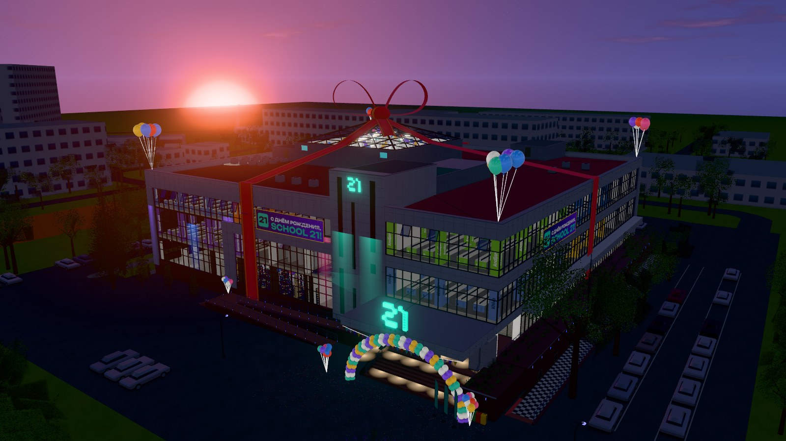

## Что внутри

- **Здание 1:1.** Ул. Зиёлилар, 13 — бывшее здание Фундаментальной библиотеки Академии наук Узбекистана (открыто в 1982 году). С 2 октября 2024 года здесь кампус School 21. В модели есть фасады, портик, козырёк, стеклянная пирамида, а также участок и соседние кварталы из OpenStreetMap.
- **Пять уровней с интерьерами:**
  - атриум −1 с лекторием-амфитеатром;
  - 1 этаж: холл с турникетами, лобби и ивент-холл на 300 мест;
  - парящая площадка +2,25 со статуей и стендами учёных Востока;
  - 2 и 3 этажи: десять кластеров, кухни, переговорные и лаунж под пирамидой.
- **Люди.** 117 человек на компьютере, около 40 на телефоне. Студенты в форме School 21 и в обычной одежде печатают за моноблоками, слушают в лектории, общаются в лобби и на площадке, ходят по галереям. В «Празднике» все собираются в ивент-холле.
- **Прогулка от первого лица** с физикой: лестницы, ограждения, мини-карта с переносом по клику, полёт сквозь стены. На телефоне — джойстик.
- **Разрезы и планы.** Любой уровень открывается разрезом. Есть SVG-планы этажей и ситуационный план участка.
- **Достоверность.** Каждая зона знает, откуда о ней известно: с поэтажного плана, с панорамы, из видео или достроена по логике здания.
- **Редактор зон** с экспортом в JSON. День, вечер и ночь.
- **Режим «Праздник»** ко дню рождения кампуса. Снаружи — лента с бантом, шары, арка у входа, флажки, конфетти, подсветка фасада и салют. Внутри ивент-холл с экраном-поздравлением, тортом, сценой и залом гостей.

## Галерея

<table>
<tr>
<td width="50%">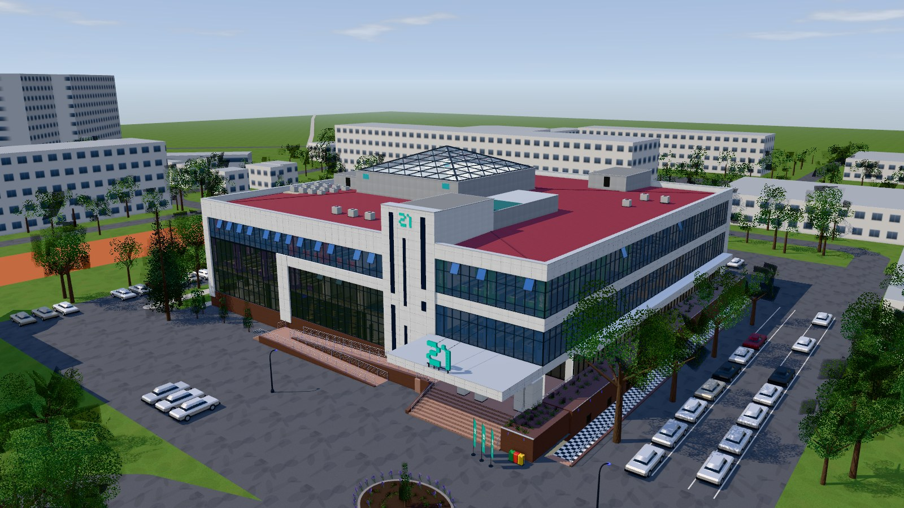<br><sub><b>Экстерьер.</b> Фасады, портик и пирамида, участок и окружение из OpenStreetMap</sub></td>
<td width="50%">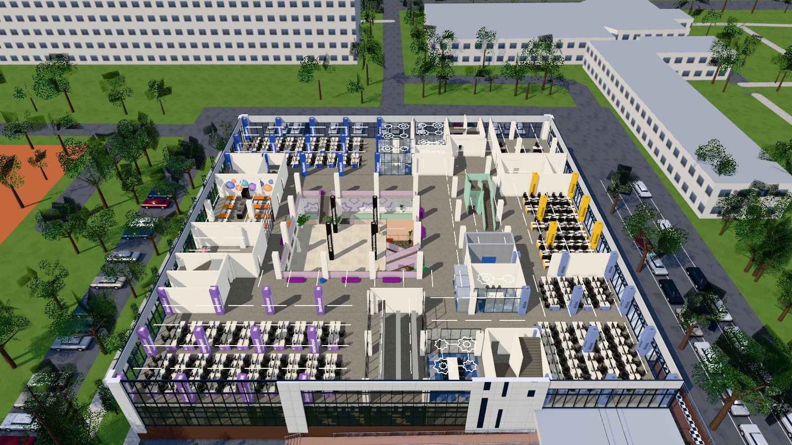<br><sub><b>Разрез 2 этажа.</b> Кластеры, галерея вокруг второго света, кухня и переговорные</sub></td>
</tr>
<tr>
<td>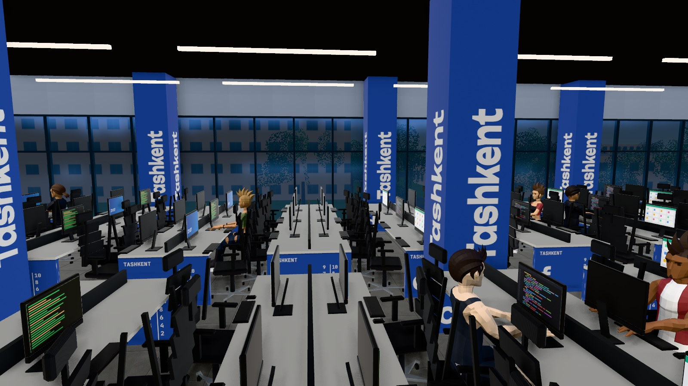<br><sub><b>Кластер Tashkent.</b> Ряды моноблоков, колонны в цвете кластера, студенты за работой (здесь <code>?crowd=2</code>)</sub></td>
<td>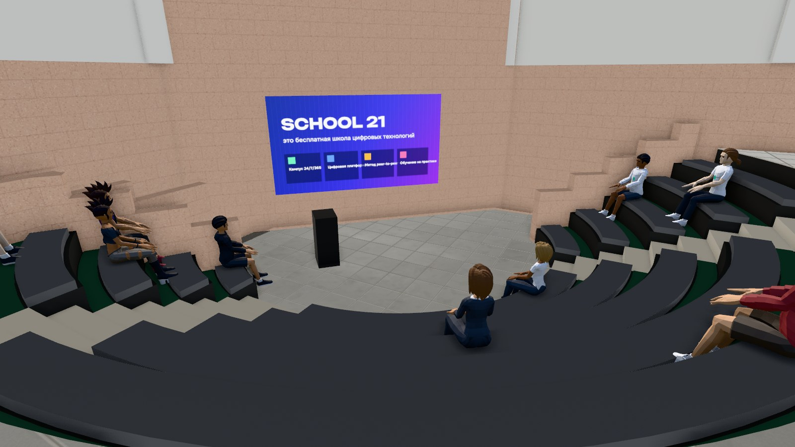<br><sub><b>Лекторий на уровне −1.</b> Здесь проходят защиты проектов и хакатоны</sub></td>
</tr>
<tr>
<td>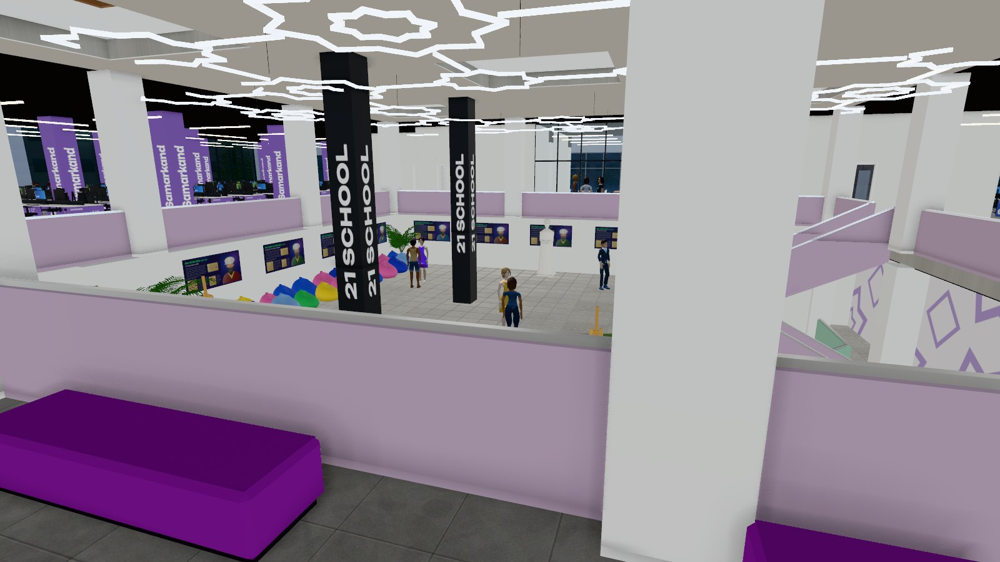<br><sub><b>Парящая площадка.</b> Вид с галереи 2 этажа: колонны «21 SCHOOL», стенды учёных</sub></td>
<td>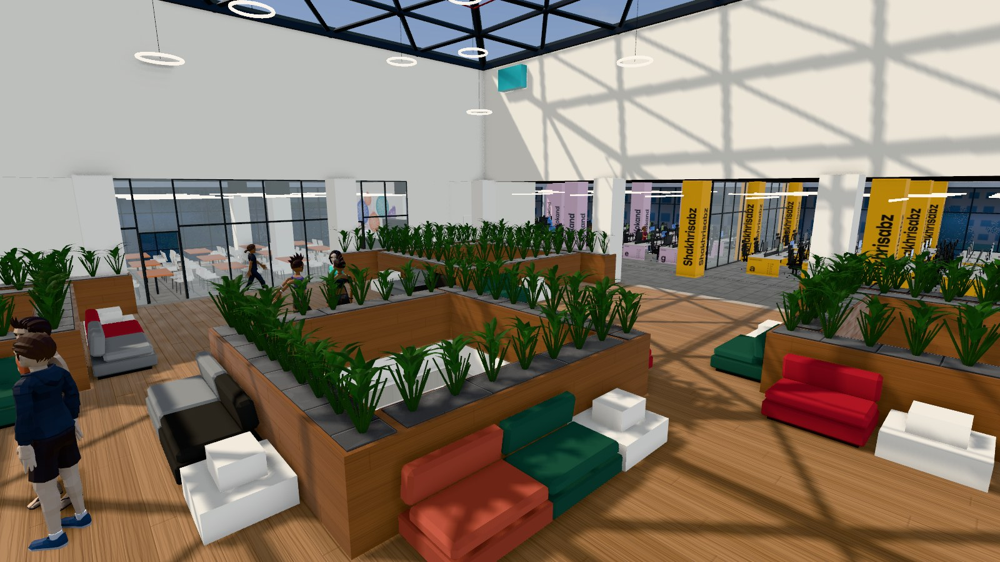<br><sub><b>Лаунж под стеклянной пирамидой.</b> Подиум, световые колодцы, диваны</sub></td>
</tr>
<tr>
<td>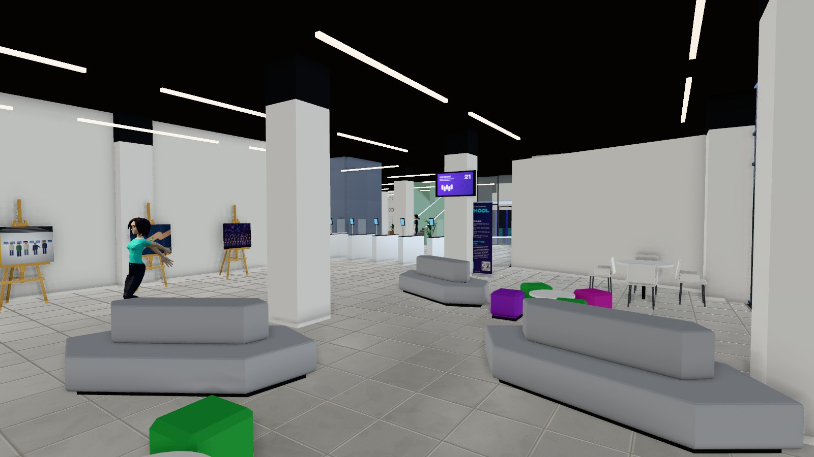<br><sub><b>Холл.</b> Мольберты с фото-холстами, турникеты Face ID, стойки «School 21»</sub></td>
<td>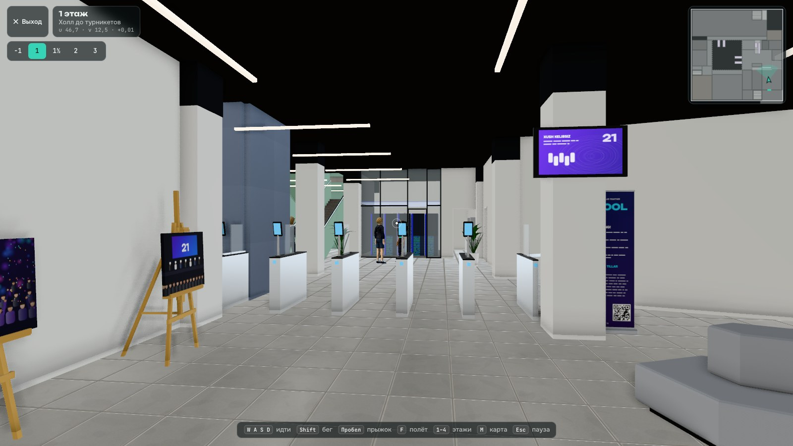<br><sub><b>Прогулка.</b> Вид от первого лица, мини-карта, этажи, подсказки по клавишам</sub></td>
</tr>
<tr>
<td>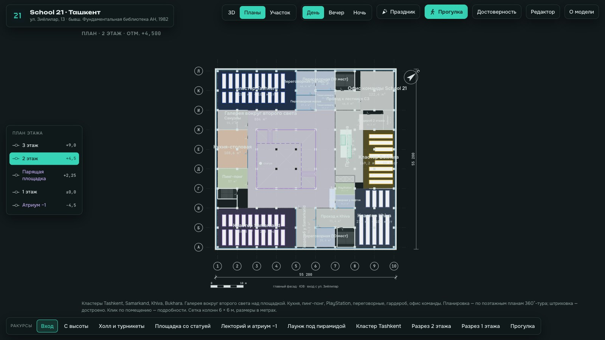<br><sub><b>Планы этажей.</b> SVG-схемы по осям колонн, клик по зоне открывает подробности</sub></td>
<td>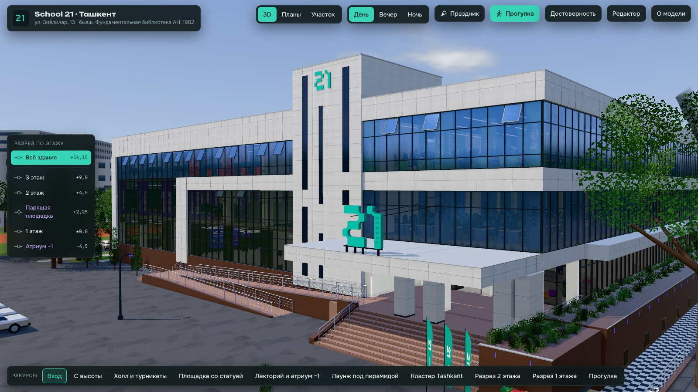<br><sub><b>Интерфейс.</b> Режимы, время суток, рейка уровней и готовые ракурсы</sub></td>
</tr>
<tr>
<td>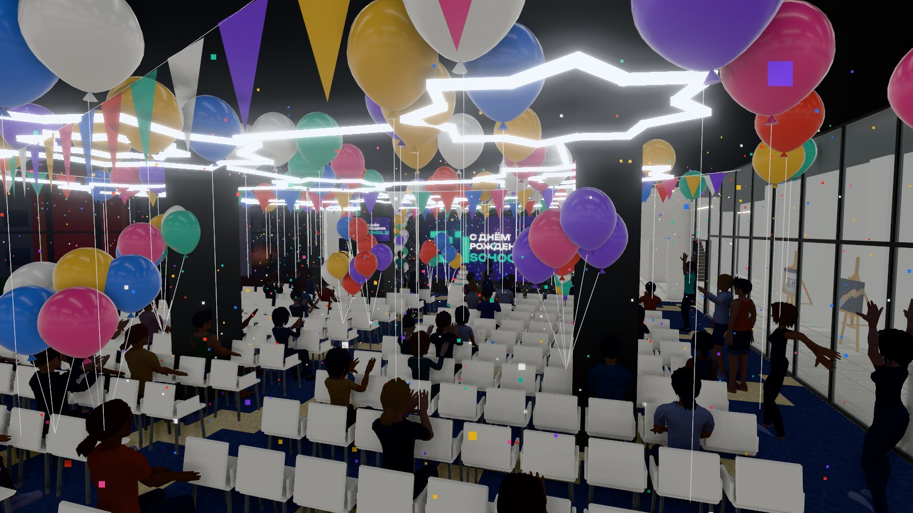<br><sub><b>«Праздник» в ивент-холле.</b> Шары, гирлянды, конфетти, гости аплодируют</sub></td>
<td>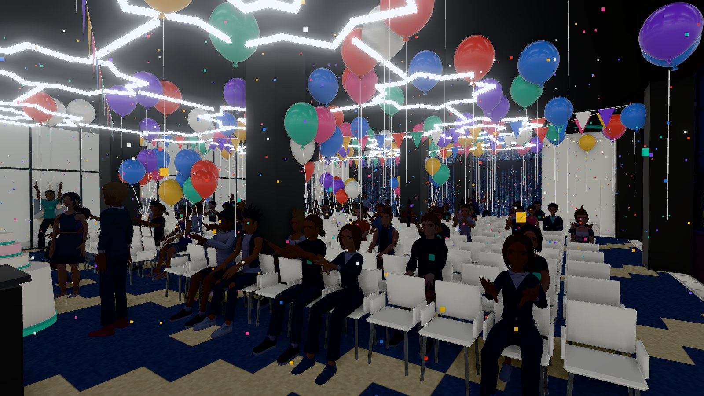<br><sub><b>Вид со сцены.</b> Ряды гостей, торт и экран с поздравлением</sub></td>
</tr>
<tr>
<td colspan="2">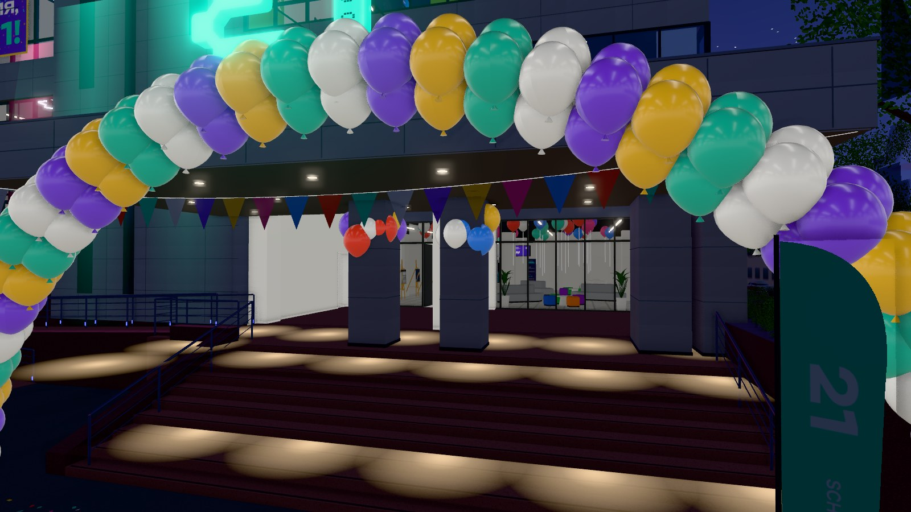<br><sub><b>Вход в синий час.</b> Арка из шаров в цветах School 21, флажки и подсветка крыльца</sub></td>
</tr>
</table>

## Быстрый старт

Сборки нет: это статический сайт на ES-модулях, three.js подключается с CDN.

```bash
git clone https://github.com/ASPanferov/school21-tashkent-3d.git
cd school21-tashkent-3d
python3 -m http.server 5321
```

Откройте http://localhost:5321. Подойдёт любой статический сервер, например `npx serve`.

| Параметр ссылки | Что делает |
|---|---|
| `?party` или `#party` | Сразу включить «Праздник» |
| `?q=low` / `?q=high` | Качество графики. По умолчанию телефоны получают `low` |
| `?people=0` | Без людей: быстрее загрузка |
| `?people=all` | Вместе с «Праздником»: люди и в зале, и по всему зданию |
| `?crowd=2` | Вдвое больше людей (от 0,2 до 6) |

## Управление

| Где | Как |
|---|---|
| Модель | Левая кнопка — вращение, правая — сдвиг, колесо — масштаб. Рейка слева — разрез по уровню, снизу — готовые ракурсы, клик по помещению — подробности |
| Прогулка | `WASD` — идти, `Shift` — бег, `Пробел` — прыжок, `F` — полёт, `1–4` и `B` — этажи, `M` — карта, `Esc` — пауза |
| Телефон | Один палец вращает, два — масштаб. В прогулке — джойстик и кнопки |

Всё о режимах, планах, редакторе и ссылках — в [руководстве](docs/GUIDE.md#как-пользоваться).

## Как устроено

- **Данные → геометрия.** Вся планировка лежит в [`src/data/building.js`](src/data/building.js): уровни, зоны-прямоугольники в метрах, стены, двери, лестницы, ядра, фасады. Модули `src/build/` строят по этим данным фасады, этажи и мебель. Поправили цифру — после перезагрузки страницы пересобрались модель, планы и коллизии.
- **Всё процедурное.** Плитка, дерево, ковролин, стенды учёных, экраны и баннеры рисуются на canvas при загрузке. Внешних картинок нет, бинарные файлы есть только у моделей людей.
- **Дёшево для видеокарты.** Статика сливается в общие буферы, мебель рисуется инстансами, тени, AO и детализация зависят от качества. Каждый человек — один `SkinnedMesh` с вершинными цветами: одежда перекрашивается без текстур, позы сидя, хлопки и ликование запекаются из костей при загрузке, анимация обновляется реже с расстоянием.
- **Прогулка** собирает один BVH-коллайдер ([three-mesh-bvh](https://github.com/gkjohnson/three-mesh-bvh)) из всего, что лежит в сцене. Игрок — капсула с гравитацией и шагом на ступени.

```
index.html             интерфейс, стили, importmap
src/
  main.js              сцена, свет и время суток, камеры, разрезы, режимы, инспектор и редактор
  data/building.js     вся планировка данными — единственный источник геометрии здания
  data/context.js      окружение из OpenStreetMap
  build/               shell (фасады), interior (этажи и мебель), furniture, site, party, people
  lib/                 координаты, материалы, процедурные текстуры и картины, прогулка, коллизии
  ui/                  SVG-планы этажей и участка
assets/people/         модели людей (Quaternius) и общий файл анимаций
tools/                 скриншоты, замер производительности, тесты прогулки и проходимости
docs/                  руководство и картинки для README
```

**Координаты.** `u` идёт вдоль главного фасада от южного угла (0…55,2 м), `v` — вглубь здания, `z` — от пола 1 этажа. Сетка колонн 6 × 6 м. Подробнее — в [AGENTS.md](AGENTS.md#координаты).

## Как менять и дорабатывать

| Хочу | Куда идти |
|---|---|
| Подвинуть стену, дверь или помещение | `ZONES`, `WALLS`, `DOORS` в `building.js`. Можно и мышью: режим «Редактор», затем экспорт JSON |
| Добавить мебель или новый тип помещения | `src/build/furniture.js` и `zoneContents()` в `src/build/interior.js` |
| Поменять людей: роли, одежду, позы, группы | `src/build/people.js` |
| Украсить праздник или поменять слайды на экране | `src/build/party.js`, `birthdayScreen()` в `src/lib/art.js` |
| Свет, время суток, ракурсы | `TIMES` и `PRESETS` в `src/main.js` |

Пошаговые рецепты с кодом — в [docs/GUIDE.md](docs/GUIDE.md). Если работаете с ИИ-агентом (Claude Code, Codex, Cursor), он найдёт карту проекта, правила и чек-лист проверки в [AGENTS.md](AGENTS.md).

### Проверка

В `tools/` лежат скрипты для headless Chrome. Нужен установленный Google Chrome, путь к нему можно задать переменной `CHROME=…`.

```bash
cd tools && npm install && cd ..
node tools/walk-test.mjs     # 29 маршрутов прогулки: вход, все лестницы, кластеры, санузлы, пандус
node tools/nav-check.mjs     # проходимость: обрывы, отрезанные места, закрытые проёмы
node tools/perf.mjs          # кадры/с и вызовы отрисовки в типовых видах
node tools/shot.mjs out/x "cluster:11.6,45.3,6.3,11.6,56.8,5.3,54"   # скриншот из точки
```

Все картинки этого README сняты через `tools/shot.mjs`.

### Деплой

Подойдёт любой статический хостинг. На Vercel: `vercel deploy --prod --yes`, без команды сборки. На GitHub Pages: ветка `main`, папка `/`.

## Точность и источники

Планировка снята с официальных поэтажных планов 360°-тура и сверена с панорамами. Каждая панорама привязана к модели по ориентирам: колоннам, статуе, экранам. На площадке совпадение около 0,2°. Где данных нет, модель достроена по логике здания, и режим «Достоверность» это показывает.

- [360°-тур Uzbekistan360](https://uzbekistan360.uz/en/location/school-21e13) — поэтажные планы и 70 панорам.
- [Видео-экскурсия по кампусу](https://www.youtube.com/watch?v=2XjpOjV1bHY) (Umed Rahimov).
- [Фото на Яндекс Картах](https://yandex.uz/maps/org/school_21/209504048996/gallery/), [Gazeta.uz об открытии](https://www.gazeta.uz/ru/2024/10/04/school-21/).
- [OpenStreetMap](https://www.openstreetmap.org/way/33203100) — контур здания и окружение.
- [«Письма о Ташкенте»](https://mytashkent.uz/2011/05/11/fundamentalnaya-biblioteka-akademii-nauk/) — история здания.

Материалы источников использованы только как референс, в репозиторий они не входят.

## Лицензии и благодарности

- **Код** — [MIT](LICENSE).
- **Данные OpenStreetMap** в `src/data/context.js` — © участники OpenStreetMap, [ODbL](https://opendatacommons.org/licenses/odbl/).
- **Модели людей** — [Quaternius](https://quaternius.com): Ultimate Modular Men Pack и Ultimate Modular Women Pack, скачаны с [Poly Pizza](https://poly.pizza). Восемь моделей под CC0. Модель «Suit» на Poly Pizza помечена CC-BY 3.0, автор указан. Подробности — в [assets/people/CREDITS.md](assets/people/CREDITS.md).
- **Библиотеки** — [three.js](https://threejs.org) и [three-mesh-bvh](https://github.com/gkjohnson/three-mesh-bvh), обе под MIT, подключаются с jsDelivr.
- **Шрифты** — Unbounded, Onest и JetBrains Mono (SIL OFL 1.1), из Google Fonts.

## Дисклеймер

Это неофициальный фан-проект, он не связан с School 21 и Сбером. Названия и логотипы принадлежат их владельцам.

---

## English

An unofficial, 1:1 interactive 3D model of the School 21 campus in Tashkent (13 Ziyolilar St., the former Fundamental Library of the Academy of Sciences, opened in 1982; the campus opened on 2 October 2024). Built with three.js, it runs in any modern browser, desktop or mobile: **[open the model](https://school21-tashkent.vercel.app)**.

- **What's inside:**
  - the exterior and five levels with interiors (atrium and lecture amphitheatre, event hall, floating platform, ten clusters, the lounge under the glass pyramid);
  - 117 animated people (about 40 on phones), students in School 21 uniform and in casual clothes;
  - a first-person walk with physics, cut-away views, SVG floor plans, a zone editor and day, evening and night lighting;
  - a festive "Party" mode for the campus birthday ([`?party`](https://school21-tashkent.vercel.app/?party)).
- **Run it:** there is no build step. Serve the folder with any static server (`python3 -m http.server 5321`) and open `http://localhost:5321`.
- **How it works:**
  - the layout is data-driven: `src/data/building.js` is the single source of the building geometry;
  - all textures and artwork are drawn procedurally on canvas;
  - people are one skinned mesh each with vertex colours and baked poses;
  - the walk mode uses a BVH collider built from the scene.
- **Docs:** recipes for changing and extending the model are in [docs/GUIDE.md](docs/GUIDE.md) (Russian). Instructions for AI coding agents are in [AGENTS.md](AGENTS.md). Headless checks (walk routes, passability, performance, screenshots) are in `tools/`.
- **Licenses:**
  - code — MIT;
  - OpenStreetMap data — ODbL;
  - people models — Quaternius (CC0; the "Suit" model is CC-BY 3.0 on Poly Pizza);
  - three.js and three-mesh-bvh — MIT;
  - fonts — SIL OFL.

  Not affiliated with School 21 or Sber.
