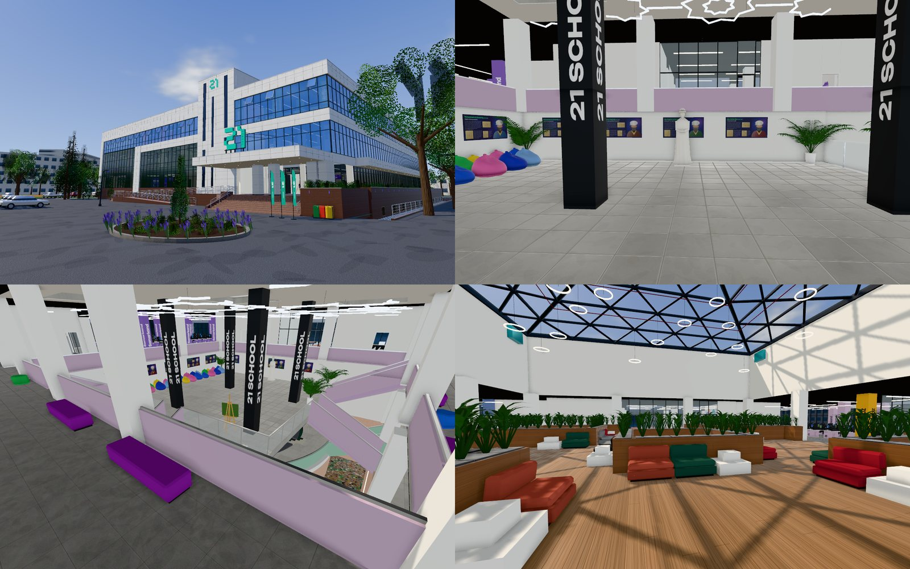

# School 21 · Ташкент — 3D-модель кампуса

Неофициальная интерактивная 3D-модель кампуса School 21 в Ташкенте (ул. Зиёлилар, 13 — бывшее здание Фундаментальной библиотеки АН РУз, 1982) в масштабе 1:1. Работает в браузере, в том числе на телефоне.

**Демо:** https://school21-tashkent.vercel.app



## Что внутри

- **Экстерьер:** фасады, портик, козырёк, участок и окружение из OpenStreetMap.
- **Уровни:** −1 (атриум с лекторием и лаунжем), 1, «парящая площадка» +2,25, 2, 3. Любой уровень можно открыть разрезом.
- **Интерьеры** по панорамам 360°-тура: кластеры, лекторий, конференц-зал, кухни, лаунж под пирамидой, стенды с учёными, мольберты с фото-холстами, статуя, турникеты с Face ID.
- **Прогулка от первого лица:** WASD и мышь, на телефоне — джойстик. Коллизии через BVH, по лестницам можно ходить.
- **Поэтажные планы** (SVG) и режим «Достоверность»: что снято по фото, что по плану, а что достроено.
- **Редактор помещений** с экспортом в JSON; день, вечер и ночь.

## Запуск локально

Сборки нет: это статический сайт на ES-модулях, three.js подключается с CDN. Подойдёт любой статический сервер:

```bash
python3 -m http.server 5321
```

Откройте http://localhost:5321. Параметры `?q=low` и `?q=high` принудительно задают качество графики (по умолчанию телефоны получают `low`).

## Как устроено

| Путь | Что там |
|---|---|
| `src/data/building.js` | Вся планировка данными: этажи, зоны (прямоугольники в метрах), стены, двери, лестницы, ядра, фасады. Правите цифры — модель пересобирается. |
| `src/data/context.js` | Окружение из OpenStreetMap в локальных координатах здания. |
| `src/build/` | Генерация геометрии: `shell.js` — фасады и перекрытия, `interior.js` — стены, лестницы и мебель по зонам, `furniture.js` — мебель и растения, `site.js` — участок. |
| `src/lib/` | Материалы и процедурные текстуры (`textures.js`, `art.js`), прогулка и коллизии (`walk.js`, `collision.js`). |
| `src/ui/` | Планы этажей и ситуационный план. |

- **Координаты:** `u` — вдоль главного (юго-восточного) фасада от южного угла, `v` — вглубь здания, `z` — от пола 1 этажа. Всё в метрах, сетка колонн 6 × 6 м.
- **Изображения:** все текстуры и картины внутри здания рисуются на canvas при загрузке. Внешних картинок в репозитории нет, кроме превью в `docs/`.

## Источники

- [360°-тур Uzbekistan360](https://uzbekistan360.uz/en/location/school-21e13) — поэтажные планы и панорамы. Использовались как референс, в репозиторий не входят.
- [Видео-экскурсия по кампусу](https://www.youtube.com/watch?v=2XjpOjV1bHY) (Umed Rahimov).
- [Фото организации на Яндекс Картах](https://yandex.uz/maps/org/school_21/209504048996/gallery/), [Gazeta.uz об открытии](https://www.gazeta.uz/ru/2024/10/04/school-21/).
- [OpenStreetMap](https://www.openstreetmap.org/way/33203100) — контур здания и окружение (© OpenStreetMap contributors, ODbL).
- [«Письма о Ташкенте»](https://mytashkent.uz/2011/05/11/fundamentalnaya-biblioteka-akademii-nauk/) — история здания.

## Точность

Планировка снята с официальных поэтажных планов тура и сверена с панорамами. Каждая панорама привязана к модели по ориентирам — колоннам, статуе, экранам; на площадке совпадение около 0,2°. Там, где данных нет, модель достроена по логике здания. Режим «Достоверность» показывает, какие части получены из каких источников. Правки удобно вносить прямо в `src/data/building.js`.

## Дисклеймер

Это неофициальный фан-проект, он не связан с School 21 и Сбером. Названия и логотипы принадлежат их владельцам.

## Лицензия

Код распространяется по лицензии [MIT](LICENSE). Данные OpenStreetMap в `src/data/context.js` — по лицензии [ODbL](https://opendatacommons.org/licenses/odbl/).

---

### English

An unofficial, 1:1 interactive 3D model of the School 21 campus in Tashkent, built with three.js. It includes the exterior, every floor with its interiors, cut-away views, SVG floor plans and a first-person walk mode with BVH collisions.

There is no build step: serve the folder with any static server. The layout is data-driven (`src/data/building.js`), and every texture and artwork inside the building is drawn procedurally on canvas.

The code is MIT-licensed; the OpenStreetMap data is under ODbL. This project is not affiliated with School 21 or Sber.
